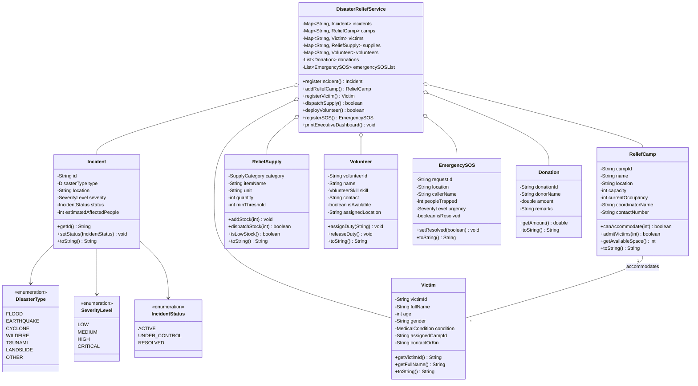

# Academic Project Report: Disaster Relief Management System (DRMS)

---

## 1. Aim
To design, model, and implement an end-to-end Object-Oriented **Disaster Relief Management System (DRMS)** in Java that centralizes emergency crisis coordination, casualty and evacuee tracking, shelter/camp capacity allocation, humanitarian aid inventory distribution, volunteer rescue team dispatch, emergency SOS distress response, and donor fund accounting.

---

## 2. Problem Statement
During natural or human-induced catastrophes (such as floods, earthquakes, cyclones, and landslides), relief operations often suffer from:
1. **Disjointed Communication:** Lack of real-time visibility into the severity and scale of affected zones.
2. **Resource Misallocation:** Inefficient distribution and stockouts of food, drinking water, medical kits, and shelter equipment.
3. **Overcrowded or Underutilized Camps:** Difficulty in tracking shelter capacities and locating missing family members.
4. **Delayed Rescue Response:** Unorganized volunteer and first-responder mobilization leading to triage bottlenecks.
5. **Lack of Transparency:** Opaque donor fund and aid allocation records.

This project delivers a centralized software solution to address these bottlenecks in real-time.

---

## 3. Objectives
- **Centralized Incident Logging:** Register and prioritize disaster events by type, location, and severity level (Critical, High, Medium, Low).
- **Shelter & Camp Capacity Management:** Maintain real-time occupancy metrics, admissions, and discharges across relief shelters.
- **Evacuee & Missing Person Registry:** Register evacuees, categorize medical triage conditions (Stable, Injured, Critical), and provide fast name-based search for family reunification.
- **Relief Supply Chain & Inventory Control:** Track inbound relief supplies, alert on low inventory thresholds, and manage dispatches to specific camps.
- **Volunteer & First Responder Mobilization:** Maintain a skill-indexed corps (Search & Rescue, Medical, Logistics, Food Distribution) and handle active deployment/recall.
- **Emergency SOS Distress Hub:** Capture high-priority emergency rescue calls with trapped casualty counts and location coordinates.
- **Aid & Financial Accountability:** Maintain transparent donation ledgers and executive command dashboards for senior incident commanders.

---

## 4. System Architecture & Modules

```
+-------------------------------------------------------------------------------+
|                       DISASTER RELIEF MANAGEMENT SYSTEM                       |
+-------------------------------------------------------------------------------+
                                        |
       +--------------------------------+-------------------------------+
       |                                |                               |
+---------------+              +-----------------+             +-----------------+
|  Core Domain  |              |  Service Layer  |             | Presentation/UI |
|    Models     |              |  (Controller)   |             |   (CLI / Web)   |
+---------------+              +-----------------+             +-----------------+
| - Incident    |              | - Incident Mgr  |             | - Executive     |
| - ReliefCamp  |<------------>| - Shelter Mgr   |<----------->|   Dashboard     |
| - Victim      |              | - Evacuee Reg   |             | - Interactive   |
| - SupplyItem  |              | - Inventory Mgr |             |   Console Menu  |
| - Volunteer   |              | - Dispatch SOS  |             | - Reports &     |
| - SOS Request |              | - Aid Ledger    |             |   Summaries     |
| - Donation    |              +-----------------+             +-----------------+
+---------------+
```

### Module Breakdown
1. **Disaster Incident & Zone Management Module:** Handles disaster lifecycle tracking, geo-location tagging, and severity ratings.
2. **Shelter & Relief Camp Management Module:** Tracks capacity limits, current headcounts, coordinator points of contact, and available space.
3. **Evacuee & Medical Triage Registry Module:** Manages evacuee records, age/gender demographics, medical urgency flags, and next-of-kin lookup.
4. **Relief Inventory & Logistics Supply Module:** Manages warehouse stock of ration packs, potable water, medical emergency kits, blankets, and hygiene supplies.
5. **Volunteer Corps & Rescue Team Dispatch Module:** Coordinates volunteer skill registries, active field dispatches, and base recalls.
6. **Distress Call & Emergency SOS Module:** Priority queue for incoming emergency rescue transmissions.
7. **Donation & Financial Aid Ledger Module:** Tracks philanthropic contributions, relief fund accumulation, and allocation purposes.
8. **Executive Command Dashboard:** Aggregates real-time KPIs for high-level decision support.

---

## 5. Algorithms & System Workflows

### Algorithm 1: Evacuee Admission & Camp Allocation
1. **Input:** Evacuee Details `(Name, Age, Gender, MedicalStatus, TargetCampId, KinContact)`.
2. Retrieve `ReliefCamp` instance matching `TargetCampId`.
3. Check if `camp.getAvailableSpace() >= 1`.
   - If **True**:
     - Instantiate `Victim` object with generated unique ID `VIC-XXX`.
     - Increment `camp.currentOccupancy` by 1.
     - Add `Victim` to global lookup map.
     - Return **Success** with assigned ID.
   - If **False**:
     - Return **Error (Camp Full - Reroute to adjacent safe zone shelter)**.

### Algorithm 2: Supply Dispatch with Threshold Alert
1. **Input:** `ItemKey`, `QuantityToDispatch`, `TargetCampId`.
2. Validate existence of `ItemKey` and `TargetCampId`.
3. Retrieve `ReliefSupply` record.
4. If `ReliefSupply.quantity >= QuantityToDispatch`:
   - Decrement `quantity = quantity - QuantityToDispatch`.
   - If `quantity <= minThreshold`:
     - Trigger **`[LOW STOCK ALERT]`** to procurement queue.
   - Log dispatch transaction to target shelter.
   - Return **Success**.
5. Else:
   - Return **Error (Insufficient stock in central warehouse)**.

---

## 6. UML Class Diagram



---

## 7. Advantages of the Proposed System
1. **Unified Command and Control:** Replaces fragmented spreadsheets and manual registers with an integrated centralized command platform.
2. **Optimized Resource Allocation:** Prevents wastage and critical supply shortages through minimum threshold alerts.
3. **Enhanced Human Safety & Rapid Search:** Fast missing person querying and medical triage prioritization ensures that high-risk individuals receive immediate medical care.
4. **Fast Volunteer Skill Matching:** Matches emergency requirements (e.g., trauma doctors vs. heavy search-and-rescue) to available certified volunteers.
5. **Auditable Aid Tracking:** Maintains an accountable record of donations and distributed relief materials.

---

## 8. Future Enhancements
- **GIS & Satellite Mapping Integration:** Integration with Google Maps / OpenStreetMap APIs to display active flood plains, safe evacuation corridors, and GPS locations of stranded victims.
- **SMS / WhatsApp Distress Gateway:** Allow victims without internet access to text their GPS coordinates or landmarks directly into the SOS dispatch queue via Twilio or GSM gateways.
- **Automated Drone Logistics Routing:** Connect with autonomous drone delivery systems for critical medical supply drops in cut-off terrain.
- **AI-Powered Casualty & Demand Forecasting:** Utilize predictive ML models to anticipate shelter demand and supply requirements before cyclone/hurricane landfall.
- **Cloud Database & Mobile App:** Transition from in-memory storage to distributed PostgreSQL/Firebase backend with Flutter/React Native mobile applications for on-ground field workers.

---

## 9. Conclusion
The **Disaster Relief Management System (DRMS)** successfully automates and streamlines complex disaster response workflows. By leveraging Object-Oriented Principles, data encapsulation, and real-time tracking across incidents, shelters, casualties, volunteers, supplies, and donations, the system drastically reduces response times and optimizes humanitarian relief operations during emergency crises.
